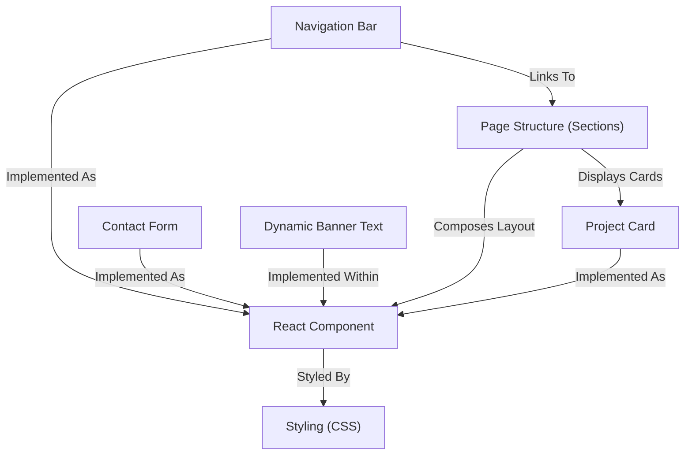

# Tutorial: My-Portfolio

This project is a personal **portfolio website** built using React.
It presents information about the owner's skills and projects through various *sections* like a banner, skills showcase, project gallery, and contact form.
The site features a *sticky navigation bar* for easy browsing and includes a *dynamic typing effect* in the banner to highlight different roles.

## Visual Overview

## Chapters

1. [Page Structure (Sections)
](01_page_structure__sections__.md)
2. [Navigation Bar
](02_navigation_bar_.md)
3. [React Component
](03_react_component_.md)
4. [Styling (CSS)
](04_styling__css__.md)
5. [Dynamic Banner Text
](05_dynamic_banner_text_.md)
6. [Project Card
](06_project_card_.md)
7. [Contact Form
](07_contact_form_.md)

---

Generated by [AI Codebase Knowledge Builder](https://github.com/The-Pocket/Tutorial-Codebase-Knowledge).
